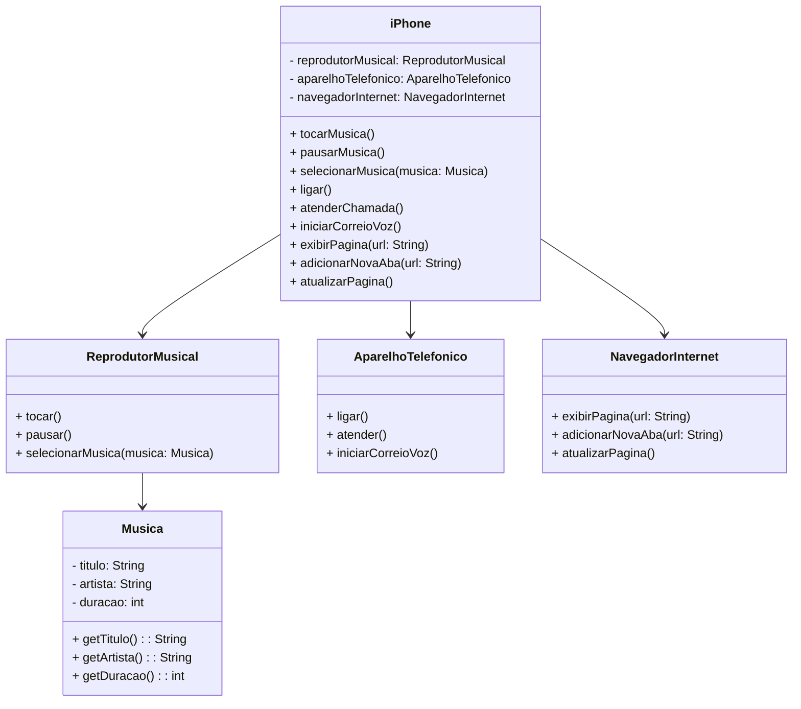

# Projeto de Prática do LabOO Java da DIO

Este é um projeto desenvolvido como parte das práticas do LabOO (Laboratório de Orientação a Objetos) Java da Digital Innovation One.

## Descrição

O objetivo deste projeto é modelar e implementar um componente básico de um iPhone, representando suas funcionalidades como Reprodutor Musical, Aparelho Telefônico e Navegador na Internet.

## Funcionalidades do iPhone

O iPhone possui as seguintes funcionalidades:

- Reprodutor Musical: Capacidade de reproduzir músicas, pausar e selecionar uma música.
- Aparelho Telefônico: Capacidade de fazer e atender chamadas, bem como iniciar correio de voz.
- Navegador na Internet: Capacidade de exibir páginas web, adicionar novas abas e atualizar a página atual.

## Autor

Este projeto foi desenvolvido por Edson Sousa.
 

